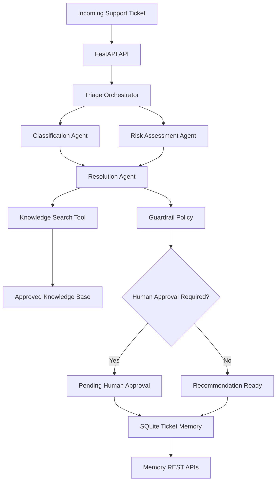

# Agentic AI Ticket Triage

[](https://github.com/BaharathBathula/Agentic-ai-ticket-triage/actions/workflows/python-ci.yml)


A production-oriented multi-agent support ticket triage system built with FastAPI, deterministic agents, grounded knowledge retrieval, guardrails, human approval, persistent SQLite memory, automated tests, GitHub Actions, and Docker.

## Overview

The system receives a support ticket and coordinates multiple specialist agents to:

1. Classify the issue.
2. Assess severity and business impact.
3. Retrieve guidance from an approved knowledge base.
4. Generate a grounded recommendation.
5. Apply safety guardrails.
6. Require human approval for critical or sensitive cases.
7. Persist the full triage result and audit trail.

## Agentic AI Concepts Demonstrated

| Concept | Implementation |
|---|---|
| Agent loop | Perceive, classify, assess, retrieve, decide, persist |
| Tool use | Knowledge search and persistent memory tools |
| Grounding | Recommendations come from approved knowledge-base records |
| Guardrails | Sensitive and critical cases require human approval |
| Human-in-the-loop | High-risk cases return `pending_human_approval` |
| Orchestrator | Coordinates all specialist agents |
| Subagents | Classification, risk, and resolution agents |
| Multi-agent system | Multiple agents collaborate on one ticket |
| Memory | SQLite-backed ticket history |
| Auditability | Every decision is recorded in `audit_trace` |
| Sandboxing | Initial version uses local controlled tools and data |
| Context handling | Ticket fields are validated and bounded with Pydantic |

## Architecture



## Project Structure

```text
Agentic-ai-ticket-triage/
├── .github/
│   └── workflows/
│       └── python-ci.yml
├── app/
│   ├── agents/
│   │   ├── classifier.py
│   │   ├── orchestrator.py
│   │   ├── resolution_agent.py
│   │   └── risk_assessor.py
│   ├── core/
│   │   ├── guardrails.py
│   │   ├── memory.py
│   │   └── models.py
│   ├── data/
│   │   └── knowledge_base.json
│   ├── tools/
│   │   └── knowledge_search.py
│   └── main.py
├── tests/
│   └── test_api.py
├── .dockerignore
├── .gitignore
├── Dockerfile
├── docker-compose.yml
├── requirements.txt
└── run.py
```

## API Endpoints

| Method | Endpoint | Purpose |
|---|---|---|
| GET | `/health` | Service health check |
| POST | `/triage` | Execute the complete triage workflow |
| GET | `/memory` | List recent persisted tickets |
| GET | `/memory/{ticket_id}` | Retrieve one ticket from memory |

## Example Request

```json
{
  "ticket_id": "INC-2001",
  "customer": "Northwind Insurance",
  "subject": "Multiple users cannot login",
  "description": "Multiple users cannot login to the production portal and receive unauthorized errors.",
  "channel": "portal"
}
```
## Engineering Highlights

- Multi-agent orchestration using specialized agents
- Deterministic fallback when no LLM is configured
- Grounded recommendations with knowledge-base citations
- Human-in-the-loop workflow for critical cases
- Persistent SQLite memory
- REST API with OpenAPI documentation
- Dockerized deployment
- GitHub Actions CI
- Type-safe Pydantic models

## Example Response

```json
{
  "ticket_id": "INC-2001",
  "category": "authentication",
  "severity": "critical",
  "confidence": 0.95,
  "recommended_action": "Verify identity-provider availability, token expiration, user permissions, recent authentication changes, and account lockout status.",
  "requires_human_approval": true,
  "status": "pending_human_approval",
  "citations": [
    "KB-AUTH-001"
  ],
  "audit_trace": [
    "classifier:authentication",
    "risk_assessor:critical",
    "knowledge_search:KB-AUTH-001",
    "guardrail:critical_severity",
    "orchestrator:confidence=0.95"
  ]
}
```

## Run Locally

Create a virtual environment:

```bash
python -m venv .venv
```

Activate it on Windows:

```powershell
.venv\Scripts\Activate.ps1
```

Install dependencies:

```bash
pip install -r requirements.txt
```

Start the API:

```bash
python run.py
```

Open:

```text
http://127.0.0.1:8000/docs
```

## Run with Docker

Build and start the container:

```bash
docker compose up --build
```

Open:

```text
http://localhost:8000/docs
```

Stop the container:

```bash
docker compose down
```

## Run Tests

```bash
pytest
```

GitHub Actions automatically runs import validation and tests on every push and pull request.

## Design Decisions

### Deterministic-first architecture

The first version intentionally uses deterministic agents instead of depending immediately on an LLM. This makes the workflow:

- testable
- reproducible
- explainable
- runnable without API keys
- safer for operational use cases

An LLM provider can be introduced later behind the same agent interfaces.

### Grounded recommendations

The resolution agent does not invent operational guidance. It retrieves recommendations from the repository-controlled knowledge base and returns the corresponding citation identifier.

### Human approval

Critical tickets and sensitive categories such as security and billing require human review before action.

## Current Capabilities

- Multi-agent orchestration
- Ticket classification
- Severity assessment
- Grounded resolution retrieval
- Safety guardrails
- Human-in-the-loop decisions
- Persistent SQLite memory
- REST-based memory inspection
- Automated testing
- GitHub Actions CI
- Docker support
- Swagger/OpenAPI documentation

## Roadmap

- [x] Multi-agent orchestration
- [x] Grounded knowledge retrieval
- [x] Guardrails and human approval
- [x] SQLite memory
- [x] Automated tests
- [x] GitHub Actions
- [x] Docker
- [ ] OpenAI-compatible LLM adapter
- [ ] Semantic knowledge retrieval
- [ ] Authentication and authorization
- [ ] PostgreSQL production persistence
- [ ] Observability and tracing
- [ ] Cloud deployment

## Disclaimer

This project is an educational and portfolio implementation. It should not be used to execute sensitive operational actions without authentication, authorization, monitoring, and organization-specific policies.
